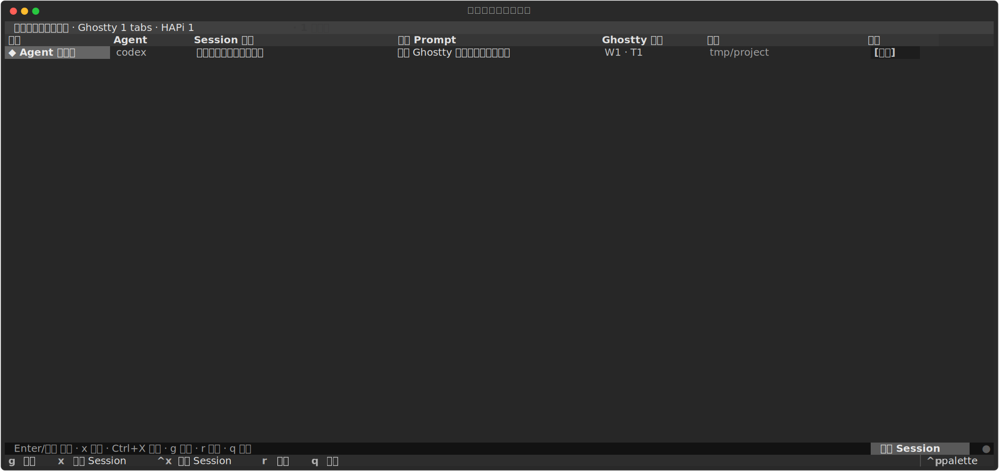
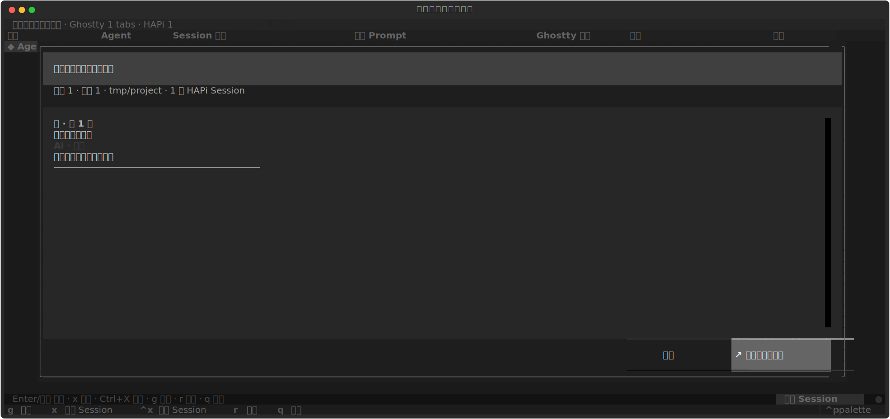
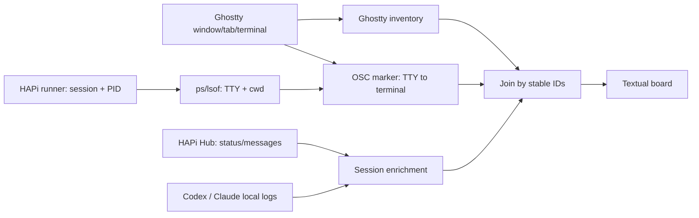

# bkanban

> A local-first TUI for seeing, resuming, and closing HAPi-powered AI sessions across your real Ghostty tabs.

`bkanban` 是一个面向 macOS + Ghostty + HAPi 用户的本地会话看板。它把 **Ghostty 当作标签事实源**，把 **HAPi 当作会话信息源**：看清谁在工作、读到每轮结论，并一键回到原标签底部。




## 为什么做 bkanban

当多个 Codex、Claude 或 TClaude Session 同时工作时，Ghostty 会持续更新标签标题，但用户仍需要在一个页面里回答这些问题：

- 这个标签到底在做什么？
- Agent 还在工作，还是已经等待下一条指令？
- 最近几轮问答得出了什么结论？
- 怎样快速回到那个标签，而且不用手动滚过几千行输出？

HAPi 知道 Session，Ghostty 知道用户真正打开的标签。`bkanban` 把两者合并，但不让 HAPi 的历史或远程 Session 污染当前标签列表。

## 功能亮点

- **真实标签集合**：Ghostty 当前打开几个 tab，看板就显示几行。HAPi 返回 0 个 Session 也不会丢标签。
- **会话可辨认**：直接展示 Ghostty 动态标签标题与首次 Prompt，标题更新后看板最多 4 秒内同步，不重复调用标题模型。
- **状态更可信**：HAPi 的等待输入/审批信号优先；Codex、Claude/TClaude 本地任务边界用于修正 `thinking=false` 的盲区。
- **只看问题与结论**：详情页保留用户输入和 AI 每轮最后正文，过滤 reasoning、tool call、tool result 和 token 噪声。
- **两次 Enter 回到现场**：第一次进详情，第二次按 stable terminal ID 跳回 Ghostty，并执行 `scroll_to_bottom`。
- **可控关闭**：精确停止 HAPi Session 后关闭对应 stable tab；批量操作有确认并冻结目标清单。
- **故障降级**：Hub、单个 Session 详情或消息请求失败时，Ghostty 标签仍保留在看板中。

## 适用范围

### 需要

- macOS
- [Ghostty](https://ghostty.org/) 1.3+（需要 AppleScript stable IDs 与 semantic actions）
- Python 3.11+
- [HAPi](https://github.com/tiann/hapi)
- 至少一个通过 HAPi 启动的 Agent，当前原生状态适配 Codex、Claude 和 TClaude

### 不是

- 通用终端管理器
- HAPi 历史 Session 浏览器
- 跨平台 Web 看板
- `hapi resume` / `attach` 的替代品

## 快速开始

### 1. 安装并启动 HAPi

以官方 npm 包为例：

```bash
npm install -g @twsxtd/hapi --registry=https://registry.npmjs.org
# 终端 A
hapi hub --no-relay
# 终端 B
hapi runner start
```

HAPi 也提供 Homebrew：

```bash
brew install tiann/tap/hapi
```

完整配置见 [HAPi Installation](https://github.com/tiann/hapi/blob/main/docs/guide/installation.md)。

### 2. 安装 bkanban

```bash
git clone https://github.com/challenwang408408/bkanban.git
cd bkanban
python3 -m venv .venv
.venv/bin/pip install -e .
```

也可以使用 `pipx` 隔离安装：

```bash
pipx install git+https://github.com/challenwang408408/bkanban.git
```

### 3. 通过 HAPi 启动 Agent

```bash
hapi codex
# 或
hapi claude
```

### 4. 检查并运行

```bash
bkanban doctor
bkanban
```

首次运行时，macOS 可能会请求允许当前终端控制 Ghostty。

## 使用方式

| 操作 | 效果 |
|---|---|
| `Enter` / 鼠标选择普通单元格 | 打开当前标签的问答详情 |
| 详情再按 `Enter` | 连接原 Ghostty terminal 并滚动到底部 |
| `g` | 直接连接当前标签并滚动到底部 |
| 行末 `[关闭]` / `x` | 确认后停止 Session 并关闭对应 Ghostty tab |
| 底部“清空 Session” / `Ctrl+X` | 确认后关闭当前快照中全部 HAPi Session tab |
| `r` | 立即刷新 |
| `q` | 退出看板，不关闭 Session |



## 状态口径

| 状态 | 主要信号 | 含义 |
|---|---|---|
| 等待输入 | HAPi `AskUserQuestion` | Agent 需要用户回答 |
| 等待审批 | HAPi pending request | Agent 需要权限或工具审批 |
| Agent 处理中 | HAPi `thinking=true` 或原生任务未结束 | 当前 turn 正在执行 |
| 后台任务中 | HAPi `backgroundTaskCount` | 有 HAPi 后台任务 |
| 在线待命 | 原生任务已完成或无明确工作信号 | Session 仍连接，可继续输入 |
| HAPi 未连接 | child 已映射，Hub 摘要不可用 | 标签保留，enrichment 降级 |
| 普通标签 | 无 HAPi Session | 普通 Ghostty tab |

状态优先级：等待输入 → 等待审批 → HAPi 处理中 → 后台任务 → Agent 原生任务边界 → 在线待命。

## 工作原理



最重要的设计不变式是：**HAPi 只能丰富已存在的 Ghostty row，不能创建 row。**

更完整的数据流、状态机、关闭协议与故障降级见 [技术方案](docs/TECHNICAL_DESIGN.md)；产品边界与路线图见 [产品方案](docs/PRODUCT_SPEC.md)。

## 隐私与本地数据

`bkanban` 是 local-first 工具，但不等于“完全不读会话”。它会读取：

- Ghostty AppleScript inventory
- `~/.hapi` 中的 runner/hub 配置与认证 token
- HAPi Hub 中的 Session 摘要和消息
- Codex 本地 SQLite / rollout JSONL 的任务边界
- Claude/TClaude 本地 transcript JSONL 的 turn 边界

本地缓存：

- `~/.local/state/notebook-hapi-board/first-prompts.json`：首次 Prompt 原文，最多 1200 字符/Session

缓存目录和文件权限分别设为 `0700` 和 `0600`。`clear-cache` 也会顺手删除旧版本遗留的 `titles.json`：

```bash
bkanban clear-cache
```

HAPi token 只用于 Authorization header，不写入 bkanban 缓存。完整安全边界见 [SECURITY.md](SECURITY.md)。

## 安全边界

- 跳转和关闭使用 stable `terminal_id` / `tab_id`，不按标题、cwd 或 tab index 猜测。
- 批量关闭只消费用户确认时冻结的 HAPi tab ID，不会关闭确认后新建的 tab。
- 普通 Ghostty tab 不进入“清空 Session”目标集。
- `bkanban doctor` 不执行 OSC marker、不改标题、不跳转、不关闭 Session。
- 关闭是破坏性操作：正在执行的前台任务会被终止。

## 已知限制

- 仅支持 macOS + Ghostty AppleScript。
- 只有 HAPi-wrapped Session 才有状态、Prompt 和问答；普通 tab 只显示为普通标签。
- Codex/Claude 本地日志格式并非稳定公开 API，Agent 升级后可能需要更新 adapter。
- 同一 tab 有多个 split/Session 时，列表只选一个 primary，详情页才展开全部 Session。
- HAPi 消息依赖 hub/socket 同步；“无记录”可能是尚未同步。
- `scroll_to_bottom` 只能确认 Ghostty 接受了动作，AppleScript 无法读回像素级 viewport offset。
- HAPi runner/hub 接口是版本耦合边界。当前实机验证基于 HAPi 0.16.x，新版兼容性欢迎通过 issue 反馈。

## 排障

### Ghostty 标签读取失败

1. 运行 `bkanban doctor`。
2. 打开“系统设置 → 隐私与安全性 → 自动化”。
3. 允许当前终端控制 Ghostty。

### 只看到普通标签

- 确认 Agent 是用 `hapi codex` / `hapi claude` 启动。
- 确认 Hub 和 runner 已启动。
- 检查 `HAPI_HOME`、`HAPI_API_URL` 和 `CLI_API_TOKEN` 是否指向同一 HAPi 环境。

### Session 名称没有及时更新

- 看板直接读取 Ghostty 标签标题，不再调用独立标题模型。
- 输入首个 Prompt 后等待一次自动刷新，最长约 4 秒；也可按 `r` 立即刷新。
- 若 Ghostty 标签本身仍是 Agent 初始名称，看板会原样显示，直到 Ghostty 更新标题。

## 开发

```bash
git clone https://github.com/challenwang408408/bkanban.git
cd bkanban
python3 -m venv .venv
.venv/bin/pip install -e .
.venv/bin/python -m unittest discover -s tests -v
```

核心目录：

```text
src/bkanban/
├── aggregate.py     # Ghostty inventory + HAPi enrichment
├── board.py         # Textual TUI 与交互
├── ghostty.py       # AppleScript、stable IDs、OSC 映射
├── hapi_client.py   # runner/hub 客户端与 Prompt cache
├── local_state.py   # Codex/Claude 原生任务边界
└── sessions.py      # 状态机与问答解析
```

## Roadmap

- [ ] macOS CI 与一次性 Ghostty E2E fixtures
- [ ] `~/.config/bkanban/config.toml`
- [ ] `doctor --verbose` 脱敏诊断包
- [ ] 可插拔 Agent state adapter
- [ ] 事件驱动刷新，降低轮询
- [ ] pipx / Homebrew 发布流程

详见 [产品方案](docs/PRODUCT_SPEC.md)。

## 贡献与安全

- 贡献方式：[CONTRIBUTING.md](CONTRIBUTING.md)
- 安全问题：[SECURITY.md](SECURITY.md)
- Bug 和兼容性反馈：[GitHub Issues](https://github.com/challenwang408408/bkanban/issues)

## License

[MIT](LICENSE) © Challen Wang
