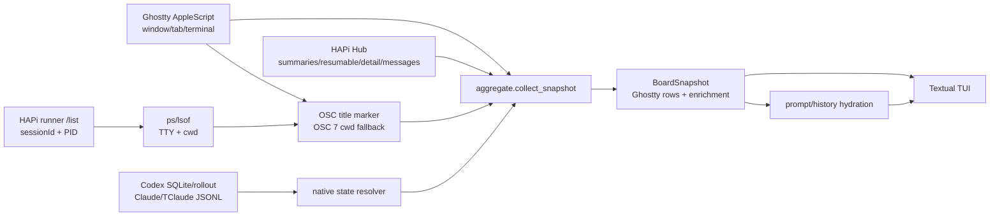
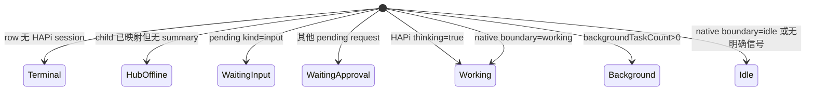
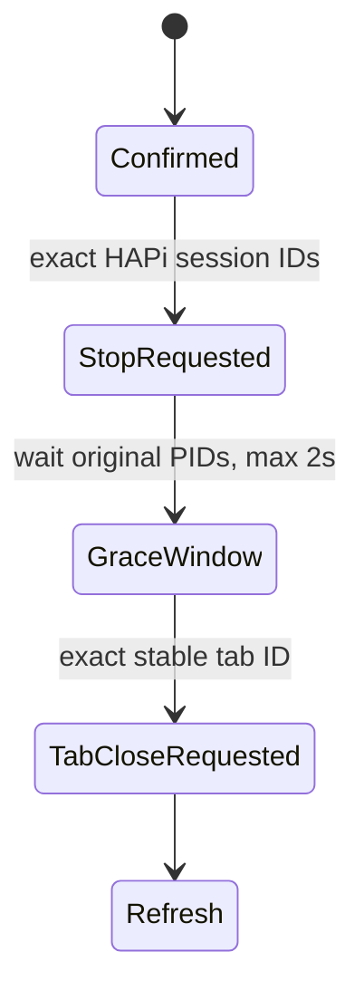

# bkanban 技术方案

## 1. 设计目标

### 目标

- 将 Ghostty 当前真实打开的 tabs 聚合为一行一 tab 的 TUI。
- 只为这些 tabs 补充 HAPi Session 状态、首次 Prompt、问答结论和关闭能力。
- 在 Hub、单个 Session 或原生日志不可用时保留 Ghostty inventory。
- 使用 stable IDs 实现精确跳转与关闭。

### 硬不变式

1. Ghostty inventory 是集合唯一事实源。
2. HAPi 返回 0 个 Session 时，Ghostty tabs 仍全部显示。
3. HAPi 历史、远程或未映射 Session 不得创建 row。
4. row key 是 stable `tab_id`；跳转 key 是 stable `terminal_id`。
5. 任何 enrichment 失败只能降级字段，不得删除 row。

### 非目标

- 不从 HAPi 进程反推集合页。
- 不使用 HAPi `resume` / `attach` 切换标签。
- 不展示 reasoning、tool payload 或 token 计数。
- 不停止全局 HAPi runner。
- 不声称能够读回验证像素级 scroll offset。

## 2. 运行边界

- macOS
- Ghostty 1.3+ AppleScript dictionary
- Python 3.11+
- `osascript`、`ps`、`lsof`
- Textual + Rich
- httpx
- HAPi runner/hub

HAPi runner/hub 接口是版本耦合边界，不被当作永久稳定的公开 SDK。当前实机契约验证基于 HAPi 0.16.x。

## 3. 系统架构

Ghostty 枚举失败是硬失败。runner、Hub、detail、messages 或 native log 失败都是可降级失败。

## 4. 领域模型

### `GhosttyTerminal`

保存 window/tab/terminal stable IDs、当前 index、title、cwd、selected 与 focused。

### `GhosttyTab`

聚合同一 tab 下的 splits。focused terminal 优先成为跳转目标。

### `HapiSession`

保存 HAPi session ID、PID、TTY、terminal ID、title、flavor、state、first Prompt 和问答 history。

### `BoardRow`

一个 Ghostty tab 对应一个 row，可关联 `0..N` 个 HAPi Session。

primary 选择：

1. 如果 focused terminal 下有 Session，仅在该池中选择。
2. 否则从 row 全部 Session 选择。
3. 状态优先级：等待输入 → 等待审批 → 工作 → 后台 → 待命 → Hub 离线。
4. 同状态按 `updatedAt` 从新到旧、再按 session ID 排序。

取舍：如果等待审批的 Session 位于非 focused split，它可能不会成为主行状态；详情页仍展开全部 Session。

## 5. 刷新与 enrichment

1. AppleScript 枚举全部 window/tab/terminal，先建立完整 `rows_by_tab`。
2. runner `POST /list` 返回 `happySessionId + PID`。
3. `ps` 只读 PID/TTY，`lsof` 只读 cwd。
4. Hub `/cli/sessions` 建 summary map。
5. resumable 只回填已存在 summary 的 name/summary/flavor/firstUserMessage，不增加 row。
6. 对每个 runner child 独立读 detail；失败时保留 summary。
7. Hub `hostPid` fallback 仅在 `machineId` 成功读取且严格匹配时生效；无 machine ID 时 fail closed。
8. TTY 通过 OSC marker 关联 Ghostty terminal。
9. 只有映射到已枚举 terminal 的 child 才挂到对应 row。
10. Textual 每 4 秒刷新并重新读取 Ghostty 标签标题；应用 snapshot 后再异步补 Prompt。

旧异步结果通过 snapshot identity 检查防止覆盖新快照。

## 6. Ghostty 与 HAPi 关联

### 信任等级

1. **强**：runner session ID + 本机 PID + TTY + OSC terminal marker。
2. **次强**：Hub active summary + 严格相同 machine ID + host PID + TTY + marker。
3. **弱**：cwd、tab title、Session display name，只用于显示或 marker 恢复，不能单独建立关联。

### OSC 映射

Ghostty AppleScript 不直接暴露 TTY。首次映射时：

1. 对验证过的 `/dev/tty*` 写入随机 OSC 2 title marker。
2. 重新枚举 Ghostty，将 marker 匹配到 terminal ID。
3. 如果动态 spinner 覆盖 title，降级为 OSC 7 临时 cwd marker。
4. best-effort 恢复原 title/cwd。
5. 缓存 `TTY -> terminal ID`，对已映射 TTY 不重复写 marker。

这个过程不是严格只读：首次映射会瞬时修改 terminal title/cwd，恢复是 best-effort。`bkanban doctor` 不执行 marker。

### 输入安全

- TTY 白名单：`tty[A-Za-z0-9._-]+`。
- OSC title 去除控制字符。
- cwd 必须是绝对路径并 URL encode。
- AppleScript string 去控制字符并转义反斜线/引号。
- subprocess 不使用 shell。

## 7. Session 状态机

合并优先级：

1. HAPi pending input。
2. HAPi pending approval。
3. HAPi `thinking=true`。
4. HAPi background task。
5. Agent native working/idle boundary。
6. 默认 idle。

### Codex adapter

- 用 HAPi `metadata.codexSessionId` 查询只读 Codex SQLite `threads.rollout_path`。
- 从 JSONL 末尾逆向扫描最近任务边界。
- `task_started` / `turn_started` → working。
- complete/abort/cancel 边界 → idle。
- 按 inode + mtime + size 缓存解析结果。

### Claude/TClaude adapter

- 用 HAPi `metadata.claudeSessionId` 精确匹配 `projects/**/<id>.jsonl`。
- 排除 `isMeta`、`isSidechain`、`toolUseResult` 和 `tool_result` 事件。
- 最近真实 Prompt 之后尚无 `end_turn` / `stop_sequence` → working。
- terminal assistant stop reason → idle。

限制：这些文件格式不是 Agent 稳定 SDK，必须用脱敏 fixture 持续验证。

## 8. Prompt、问答与标题

### 首次 Prompt

优先级：

1. 本地 Prompt cache。
2. resumable `firstUserMessage`。
3. messages 中第一条真实 user text。
4. “尚未同步”。

已知 command/system wrapper 前缀会被跳过。

### 问答结论

- 每个真实 user message 建立一轮。
- 同轮 agent 可见正文不断覆盖，保留最后一条作为结论近似值。
- reasoning、tool call、tool result 不进详情。
- `all_messages` 最多读 15 页 × 200 条。
- UI 最多保留末 60 轮，长文使用 head + tail 截断。

这是对已知 HAPi schema 的 best-effort parser，不声称对未知 Agent schema 永远能识别“最终结论”。

### 任务标题

- `GhosttyTab.title` 是 Session 名称的唯一展示事实源。
- Agent 启动初期显示 Ghostty 当前的 Agent 初始标题；输入 Prompt 后，Ghostty 更新标题，看板在下一次 4 秒刷新时同步。
- HAPi display name 仅在 Ghostty 标题为空时兜底，不参与 tab 关联、跳转或关闭。
- 标题展示不调用独立模型，也不为标题额外外发 Prompt。

## 9. 跳转协议

1. 使用 snapshot 保存的 stable terminal ID。
2. AppleScript 遍历 windows/tabs/terminals 做 exact ID 匹配。
3. `activate window`。
4. `select tab`。
5. `focus terminal`。
6. 优先 `perform action "scroll_to_bottom"`。
7. 未确认时尝试 `Command+End`。
8. 只聚焦成功但未确认滚动时，UI 发出 warning。

不调用 HAPi resume/attach，避免创建新 Session 或改变当前控制关系。

## 10. 关闭协议

### 单个 Session tab

实现约束：

- 只调用 runner `/stop-session`，绝不停止 runner。
- HAPi stop 失败不阻止 Ghostty tab 关闭，但 UI 给出清理未确认 warning。
- grace window 只检查原 PID 是否消失，不主动 kill。
- 最终依靠 Ghostty 关闭 PTY 来结束仍附着的前台子进程。
- tab ID 已不存在时不改用 index/title 补位。

### 批量关闭

- 用户确认时冻结 `(tab ID, session IDs, PIDs)`。
- 只冻结已关联 HAPi Session 的 rows。
- 执行时不重新扩大范围。
- tab ID 去重，multi-split 只关闭一次。
- AppleScript 对每个 exact ID 重新查找，不受前一个 tab 关闭导致的 index 位移影响。

剩余风险：runner stop success 不等于整个进程树、archive 和 Hub 状态已经最终一致。当前采用短 grace + Ghostty PTY close，但仍应在未来 E2E 中覆盖真实 process tree。

## 11. 故障隔离与缓存

### Endpoint 独立退避

HAPi service 为不同 endpoint 使用独立 key：

- `sessions`
- `resumable`
- `detail:<id>`
- `messages:<id>`

失败后退避 15 秒。summary/resumable/detail 可返回 last-good deep copy；messages 不使用旧缓存。

### 本地缓存

- Prompt cache 存储首次 Prompt 原文。
- 目录 `0700`，文件 `0600`。
- 先写临时文件，再 atomic replace。
- `bkanban clear-cache` 删除 Prompt cache，并兼容清理旧版 title cache。

### 并发

- TTY mapping 使用全局 lock。
- Hub HTTP client 使用 RLock。
- cache 使用进程内 lock。
- Textual worker 按 refresh/prompts/detail/focus/close 分组，关键 worker 使用 `exclusive=True`。

## 12. 安全与隐私

### 本地读取

- Ghostty automation state。
- `~/.hapi` runner/hub 配置与 token。
- HAPi Session messages。
- Codex SQLite/rollout。
- Claude/TClaude transcripts。
- bkanban state cache。

### 外部网络

- 配置的 HAPi Hub。

### 凭据

- HAPi token 只进 Authorization header，不写 bkanban cache。
- `HAPI_API_URL` 是信任边界；远程 Hub 应使用 HTTPS。
- 错误信息不应打印 Authorization header、token、完整私密消息或完整进程命令行。

## 13. 测试策略

当前单元/组件测试覆盖：

- Ghostty tab 分组与 multi-split。
- stable ID 跳转、滚动与精确关闭。
- TTY 校验和 OSC title/cwd fallback。
- Ghostty 事实源不变式。
- HAPi endpoint 失败隔离与 last-good cache。
- 状态优先级。
- Codex/Claude native boundaries。
- Prompt cache。
- 问答结论提取。
- Textual 两次 Enter、关闭确认和批量冻结。

尚未完全覆盖：

- 真实 Ghostty 多窗口/splits E2E。
- HAPi 多版本 contract fixtures。
- PID reuse 和真实进程树 lifecycle。
- 多进程 cache 竞争。
- 真实 Hub 离线/恢复的 stale 标识。

## 14. 发布门禁

每次公开发布应至少执行：

1. Python 3.11–3.13 单元测试。
2. fresh venv / wheel install smoke test。
3. `bkanban --version`、`list`、`doctor` smoke test。
4. secret scan：API key/token/个人绝对路径/内网域名。
5. 归档扫描：不包含 `.env`、`.DS_Store`、`__pycache__`、`.pyc`、本地 cache。
6. 截图脱敏并确认与当前 UI 一致。
7. 破坏性 Ghostty E2E 仅在一次性测试 window/tab 上 opt-in 执行。
